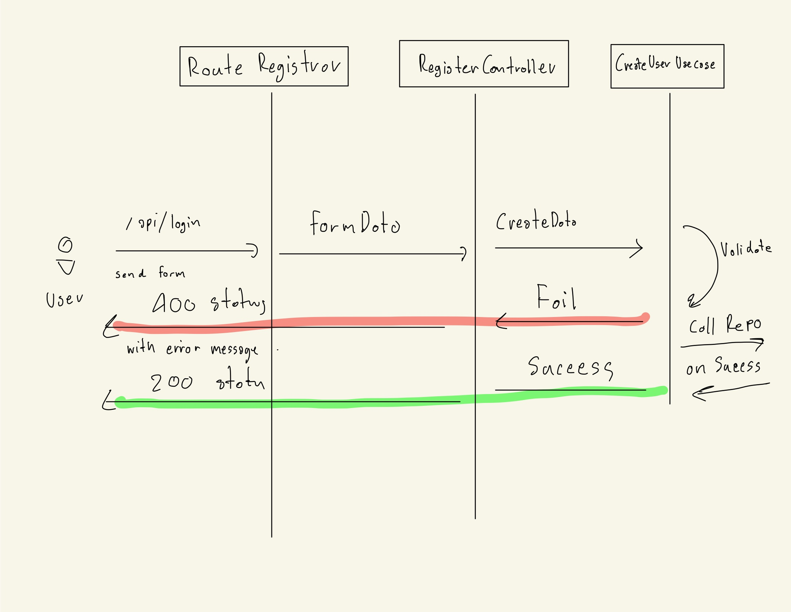

# Exam 5.2(System Design)

## Entity or Model

- User
- UserSession
- ForgetForm
- RegisterForm

## UseCase or Domain

Functions which define Business Logic

- UserLogin(User user)
- UseLogout(User user)
- CreateNewUser(User user)
- ForgetPasswordController(User user)

## Repository

Use as interface between Application - 3rd Party Software like Mysql, External service API, Redis

- SessionRepository()
- UserRepository()

## Routing (API)

Define available URLs path for request

- POST api/v1/auth/login
- GET api/v1/auth/logout
- POST api/v1/auth/register
- POST api/v1/auth/forget

## Controller

Use for handle request

- AuthenticationMiddleware(UserSession session)

- LoginController(LoginForm form)
- RegisterController(RegisterForm form)
- ForgetPasswordController(ForgetForm form)
- LogoutController(UserSession session)

# Exam 5.2
Register flow with validate
